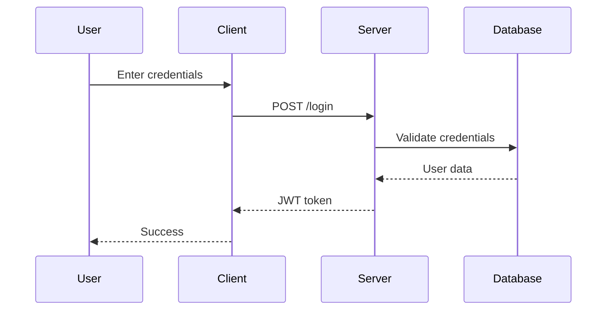

# Manual Testing: Diagram Tool Flow

## Overview

This task provides comprehensive manual testing procedures for the BlueKit diagram tool flow, covering both `bluekit_diagram_createDiagram` and `bluekit_diagram_generateDiagram` tools.

## Prerequisites

- BlueKit MCP server running and accessible
- Access to MCP client (Cursor or compatible)
- Project directory: `/Users/stephanchiorean/Documents/projects/blueKitApps/blueKitMcp`
- Ability to verify file system changes in `.bluekit/diagrams/` directory

## Test Scenarios

### Test 1: Basic Diagram Creation Flow

**Objective**: Test the complete flow from diagram creation request to file generation.

**Steps**:
1. Call `bluekit_diagram_createDiagram` with:
   - `description`: "Create a simple API flow diagram showing client, API gateway, service, and database"
   - `projectPath`: (optional, should default to current directory)

2. **Verify Response**:
   - ✅ Instructions are returned with clear guidance
   - ✅ Instructions mention YAML front matter requirements
   - ✅ Instructions include example diagram format
   - ✅ Instructions warn about common mermaid syntax issues

3. Call `bluekit_diagram_generateDiagram` with:
   - `name`: "test-api-flow"
   - `content`: Valid mermaid diagram with complete YAML front matter:
     ```yaml
     ---
     alias: API Flow Diagram
     description: Simple API request flow through client, gateway, service, and database
     tags:
       - api
       - flow
       - architecture
     ---
     
     ```mermaid
     graph TB
         Client[Client Application]
         API[API Gateway]
         Service[Backend Service]
         DB[(Database)]
         
         Client -->|HTTP Request| API
         API -->|Route| Service
         Service -->|Query| DB
         DB -->|Data| Service
         Service -->|Response| API
         API -->|HTTP Response| Client
     ```
     ```

4. **Verify File Creation**:
   - ✅ File created at `.bluekit/diagrams/test-api-flow.mmd`
   - ✅ File contains correct YAML front matter
   - ✅ File contains valid mermaid code
   - ✅ No errors or warnings in response

**Expected Result**: Diagram file successfully created with proper structure.

---

### Test 2: YAML Front Matter Auto-Generation

**Objective**: Verify that missing YAML front matter is automatically added.

**Steps**:
1. Call `bluekit_diagram_generateDiagram` with:
   - `name`: "test-auto-frontmatter"
   - `content`: Only mermaid code (no YAML front matter):
     ```mermaid
     graph LR
         A[Start] --> B[End]
     ```

2. **Verify Auto-Generation**:
   - ✅ File created successfully
   - ✅ YAML front matter automatically added
   - ✅ `alias` field populated from diagram name (formatted as "Test Auto Frontmatter")
   - ✅ `description` field exists (may be empty, which should trigger warning)
   - ✅ `tags` field exists as empty array (should trigger warning)

**Expected Result**: Missing front matter is auto-generated with default values.

---

### Test 3: Empty Tags and Description Warnings

**Objective**: Verify that warnings are shown when tags or description are empty.

**Steps**:
1. Call `bluekit_diagram_generateDiagram` with:
   - `name`: "test-empty-metadata"
   - `content`: Diagram with empty tags and description:
     ```yaml
     ---
     alias: Test Diagram
     description: ""
     tags: []
     ---
     
     ```mermaid
     graph TB
         A --> B
     ```
     ```

2. **Verify Warnings**:
   - ✅ File created successfully
   - ✅ Warning message about empty tags
   - ✅ Warning message about empty description
   - ✅ Warnings are clearly formatted with ⚠️ emoji

**Expected Result**: Appropriate warnings displayed for incomplete metadata.

---

### Test 4: @ Symbol Auto-Fix

**Objective**: Verify that @ symbols at the start of node labels are automatically fixed.

**Steps**:
1. Call `bluekit_diagram_generateDiagram` with:
   - `name`: "test-at-symbol-fix"
   - `content`: Diagram with @ symbol in node label:
     ```yaml
     ---
     alias: Test @ Symbol Fix
     description: Testing automatic @ symbol removal from node labels
     tags:
       - test
       - mermaid
     ---
     
     ```mermaid
     graph TB
         Node1[@modelcontextprotocol/sdk]
         Node2[normal-label]
         Node1 --> Node2
     ```
     ```

2. **Verify Auto-Fix**:
   - ✅ File created successfully
   - ✅ Response mentions auto-fix applied
   - ✅ @ symbol removed from node label in saved file
   - ✅ File contains "modelcontextprotocol/sdk" instead of "@modelcontextprotocol/sdk"
   - ✅ No parse errors

**Expected Result**: @ symbols automatically removed and file saved correctly.

---

### Test 5: Invalid Mermaid Syntax Detection

**Objective**: Verify that invalid mermaid syntax is detected and reported.

**Steps**:
1. Call `bluekit_diagram_generateDiagram` with:
   - `name`: "test-invalid-syntax"
   - `content`: Diagram with unclosed bracket:
     ```yaml
     ---
     alias: Test Invalid Syntax
     description: Testing error detection for invalid mermaid syntax
     tags:
       - test
     ---
     
     ```mermaid
     graph TB
         Node1[Unclosed bracket
         Node2[Valid Node]
         Node1 --> Node2
     ```
     ```

2. **Verify Error Handling**:
   - ✅ Error thrown with clear message
   - ✅ Error message lists specific syntax issues
   - ✅ File NOT created
   - ✅ Error message is actionable

**Expected Result**: Invalid syntax detected and error thrown before file creation.

---

### Test 6: Special Characters in Labels

**Objective**: Verify handling of special characters at start of node labels.

**Steps**:
1. Call `bluekit_diagram_generateDiagram` with:
   - `name`: "test-special-chars"
   - `content`: Diagram with various special characters:
     ```yaml
     ---
     alias: Test Special Characters
     description: Testing special character handling in node labels
     tags:
       - test
     ---
     
     ```mermaid
     graph TB
         Node1[#hashtag-label]
         Node2[$dollar-label]
         Node3[%percent-label]
         Node1 --> Node2
         Node2 --> Node3
     ```
     ```

2. **Verify Handling**:
   - ✅ Warnings or errors about special characters
   - ✅ Appropriate guidance provided
   - ✅ File may or may not be created (depending on severity)

**Expected Result**: Special characters detected and appropriate warnings/errors shown.

---

### Test 7: Multiple Diagram Types

**Objective**: Verify support for different mermaid diagram types.

**Steps**:
1. Test each diagram type:
   - **Flowchart**: `graph TB` (already tested)
   - **Sequence Diagram**: `sequenceDiagram`
   - **Class Diagram**: `classDiagram`
   - **State Diagram**: `stateDiagram-v2`

2. For each type, call `bluekit_diagram_generateDiagram` with valid content.

3. **Verify**:
   - ✅ Each diagram type creates file successfully
   - ✅ YAML front matter preserved
   - ✅ Diagram content correctly saved
   - ✅ No syntax errors

**Example Sequence Diagram**:
```yaml
---
alias: User Login Sequence
description: Sequence diagram showing user login flow
tags:
  - sequence
  - authentication
---

```

**Expected Result**: All diagram types supported and saved correctly.

---

### Test 8: Project Path Resolution

**Objective**: Verify correct handling of absolute and relative project paths.

**Steps**:
1. Test with absolute path:
   - Call `bluekit_diagram_generateDiagram` with:
     - `projectPath`: `/Users/stephanchiorean/Documents/projects/blueKitApps/blueKitMcp`
     - Verify file created in correct location

2. Test with relative path:
   - Call `bluekit_diagram_generateDiagram` with:
     - `projectPath`: `../blueKitMcp` (from a different directory)
     - Verify path resolution works correctly

3. Test with default (no projectPath in createDiagram):
   - Call `bluekit_diagram_createDiagram` without `projectPath`
   - Verify defaults to `process.cwd()`

**Expected Result**: All path formats handled correctly.

---

### Test 9: Directory Creation

**Objective**: Verify that `.bluekit/diagrams/` directory is created if it doesn't exist.

**Steps**:
1. If `.bluekit/diagrams/` exists, temporarily rename it
2. Call `bluekit_diagram_generateDiagram` with valid content
3. **Verify**:
   - ✅ Directory created automatically
   - ✅ File created in new directory
   - ✅ No errors about missing directory
4. Restore original directory structure

**Expected Result**: Directory auto-created when missing.

---

### Test 10: File Overwrite

**Objective**: Verify behavior when generating diagram with existing name.

**Steps**:
1. Create a diagram with name "test-overwrite"
2. Call `bluekit_diagram_generateDiagram` again with same name but different content
3. **Verify**:
   - ✅ File is overwritten (no error)
   - ✅ New content replaces old content
   - ✅ File modification time updated

**Expected Result**: Existing files are overwritten without error.

---

## Acceptance Criteria

- [ ] **AC-1**: `bluekit_diagram_createDiagram` returns comprehensive instructions with YAML front matter requirements
- [ ] **AC-2**: `bluekit_diagram_generateDiagram` successfully creates diagram files in `.bluekit/diagrams/` directory
- [ ] **AC-3**: Missing YAML front matter is automatically generated with default values
- [ ] **AC-4**: Empty tags and description trigger appropriate warnings
- [ ] **AC-5**: @ symbols at start of node labels are automatically removed and fix is reported
- [ ] **AC-6**: Invalid mermaid syntax is detected and errors are thrown before file creation
- [ ] **AC-7**: All major mermaid diagram types (graph, sequence, class, state) are supported
- [ ] **AC-8**: Both absolute and relative project paths are handled correctly
- [ ] **AC-9**: `.bluekit/diagrams/` directory is auto-created if missing
- [ ] **AC-10**: Existing diagram files are overwritten without error

## Test Execution Checklist

Before starting:
- [ ] MCP server is running
- [ ] Test directory structure is clean
- [ ] Have access to verify file system changes

After each test:
- [ ] Document results (pass/fail)
- [ ] Note any unexpected behavior
- [ ] Clean up test files if needed

After all tests:
- [ ] Review all test results
- [ ] Document any bugs or issues found
- [ ] Verify all acceptance criteria met
- [ ] Clean up all test files

## Notes

- Test files should be cleaned up after testing to avoid cluttering the diagrams directory
- Some tests may require manual verification of file contents
- Pay attention to warning messages and ensure they're helpful and actionable
- Test edge cases like very long names, special characters in file names, etc.

## Complexity Estimate

**Score: 4/10** (Moderate)

- **Technical difficulty**: Low - primarily manual testing and verification
- **Scope**: Medium - covers multiple tool functions and edge cases
- **Unknowns**: Low - well-defined testing scenarios
- **Risk**: Low - testing only, no code changes

**Estimated Time**: 2-3 hours for comprehensive testing


